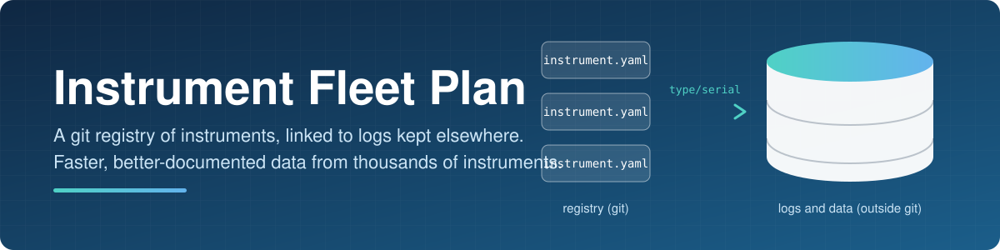
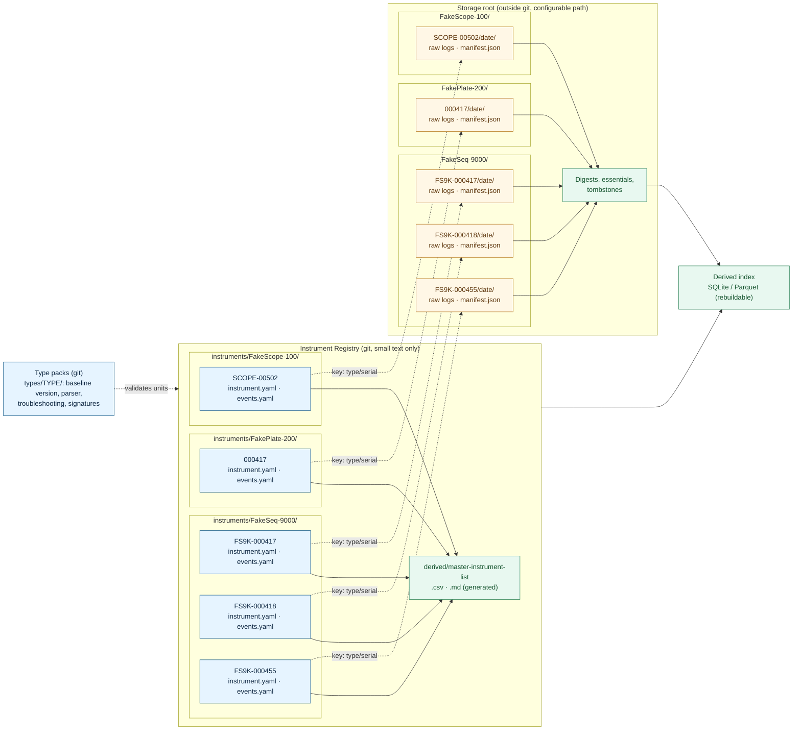
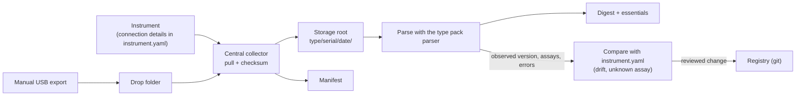

<p align="center">
  
</p>

<h1 align="center">Instrument Fleet Plan</h1>

<p align="center">
  Planning and worked examples for a data platform that tracks thousands of lab instruments.<br>
  A small git registry holds what each instrument <em>is</em>; bulk logs and data live elsewhere.
</p>

<p align="center">
  
  
  
  
</p>

---

## Overview

The goal is to **reduce the time it takes to get trusted data**. To do that, the platform needs to know, for
about 100 instrument types and thousands of units: which instrument it is, what software it runs, how to
connect to it, what its logs say, and which assays it ran. Logs total 1-10 TB per month, so they cannot live in git.

> [!NOTE]
> This is a planning repository. Nothing here is implemented yet, and every instrument, serial, log and person in
> `examples/` is invented.

## Table of contents

- [Overview](#overview)
- [How the pieces fit together](#how-the-pieces-fit-together)
- [Where data and log files live](#where-data-and-log-files-live)
- [Repository map](#repository-map)
- [Documentation summary](#documentation-summary)
- [Environment setup (WSL + conda)](#environment-setup-wsl--conda)

## How the pieces fit together

The registry is one git repo with one folder per instrument type and one subfolder per serial number. Each unit is
identified by an immutable key, `<type>/<serial>`. That key is the only link between a unit's small git record and
its large files in storage: the same `type/serial` path is used on both sides.



- **Registry (git):** `instrument.yaml` holds current per-serial facts; `events.yaml` is an append-only history of
  repairs, moves, and part swaps. The master list is generated from these files.
- **Type packs (git):** facts shared by every unit of a type (baseline version, connection procedure, parser,
  troubleshooting) are stored once per type, not copied into each serial.
- **Storage (not git):** raw logs and data are stored under the same `type/serial` path, with a write-once
  manifest beside them. Reduced summaries (digests, essentials, tombstones) are kept long term.
- **Derived index:** a rebuildable search and dashboard cache. It is never a source of truth.

## Where data and log files live

Git holds only small text. Everything large is stored elsewhere and found through the unit's key.

| Item | Location | In git? |
|:--|:--|:--:|
| Per-serial facts and event history | Registry: `instruments/<type>/<serial>/` | Yes |
| Type-wide knowledge (parser, troubleshooting, retention) | Type pack: `types/<type>/` | Yes |
| Raw logs and data | Storage root: `<type>/<serial>/<date>/`, write-once, packed per run | No |
| Manifest (file names, sizes, SHA-256 checksums) | Beside the data in the storage root | No |
| Digests, essentials extracts, tombstones | Storage root, kept permanently | No |
| Master list, observed-version scans, search index | Generated; delete and rebuild at any time | No |

How logs get from an instrument to storage:



Key rules:

- The storage location is a **configurable root path**; all references are relative to it, so the storage can move
  (local disk, network share, or S3-compatible store) without editing the registry.
- Raw files are **write-once** and copied as-is. Re-running a collection never overwrites or duplicates a file.
- Raw logs can be deleted only under an owner-approved retention policy after a verified parse, and a **tombstone**
  (checksum, size, date, policy) is kept so it is provable what existed.
- Credentials are never stored in the registry; only a reference such as `vault://instruments/<type>/<serial>`.

In the examples, each unit's `sample_logs/` and `manifests/` folders are stand-ins for this external storage.

## Repository map

```text
instrument-fleet-plan/
├── README.md                     this file
├── environment.yml               conda environment (source of truth for packages)
├── assays/                       assay list, turnaround min/max days, instrument types
├── assets/                       banner image
├── examples/
│   ├── Instrument-Registry/      example registry and generated master list
│   └── FakeSeq-9000/             example type with five serial-number folders
└── local/                        planning documents
```

## Documentation summary

### Example READMEs

| Document | What it covers |
|:--|:--|
| [Instrument Registry](examples/Instrument-Registry/README.md) | A fictional mixed fleet of four instruments. Explains the registry model, the `<type>/<serial>` permanent key, naming conventions, what belongs in `instrument.yaml` and `events.yaml`, statuses, and how `build_master_list.py` validates records and generates the master list. |
| [FakeSeq-9000](examples/FakeSeq-9000/README.md) | One instrument type with five fake DNA sequencers. Each serial shows a different situation: a repaired fault, a healthy unit, software version drift, a move between buildings, and an open repair. Includes the unit folder layout and quick-start commands. |
| [FS9K-000417](examples/FakeSeq-9000/FS9K-000417/README.md) | A single unit folder (and its four siblings): what each file is, where it would live in the real design, and how to run the scripts (`scan_logs.py`, `make_manifest.py`, `collect_logs.sh`). |

### Assay information

| Document | What it covers |
|:--|:--|
| [Assays](assays/README.md) | The original 402-assay list, a derived table with turnaround split into min and max days, an in-house guess based on turnaround, and a guessed instrument type (with basis and confidence). Also a definition table for each instrument type, plots of which assays take the longest, and the scripts that rebuild them. |

### Planning documents (`local/`)

| Document | What it covers |
|:--|:--|
| [Problem statement](local/instrument-fleet-problem-statement.md) | The goal (shorten time to data), the current situation (about 100 instrument types, about 400 assays, many outsourced), why it is a problem, what success looks like, and open questions. |
| [Plan](local/instrument-fleet-plan.md) | Concise plan: requirements, scope, the architecture decisions and the reasoning behind each, phases, verification steps, and open items. |
| [Detailed explanation](local/instrument-fleet-plan-detailed-explanation.md) | Step-by-step reasoning, how the design evolved, flow charts (system overview, ingestion, retention, version tracking, repo layout, assay tagging, troubleshooting), and advantages, disadvantages, and alternatives. |
| [Potential problems](local/instrument-fleet-potential-problems.md) | 51 ranked risks and problems, with a summary table, details, dependencies among the top problems, and next steps. |
| [Problem breakdown](local/instrument-fleet-problem-breakdown.md) | General planning suggestions and a per-problem breakdown, ending with a suggested order to start. |
| [Misc notes](local/misc-note.md) | Working notes and ideas: to-do items, assay analysis tasks, a knowledge corpus, and future multi-instrument AI analysis. |

## Environment setup (WSL + conda)

All commands run in WSL (Ubuntu), not in Windows PowerShell. The repo is at
`/mnt/c/Users/delpr/github/instrument-fleet-plan`. Conda is installed at `~/miniconda3` and is not on PATH by default.

### Use the environment

```bash
~/miniconda3/bin/conda init bash   # once, then restart the shell
conda activate instrument-fleet-plan
```

### Recreate it from scratch

```bash
cd /mnt/c/Users/delpr/github/instrument-fleet-plan
conda env create -f environment.yml
```

If this fails with `CondaToSNonInteractiveError`, conda is checking the Anaconda `defaults` channels even though
`environment.yml` uses `nodefaults`. Either:

- accept the Terms of Service yourself (only if you agree to them):
  ```bash
  conda tos accept --override-channels --channel https://repo.anaconda.com/pkgs/main
  conda tos accept --override-channels --channel https://repo.anaconda.com/pkgs/r
  ```
- or bypass `defaults` by creating the environment directly (this is how it was first built):
  ```bash
  conda create -n instrument-fleet-plan --override-channels -c conda-forge python=3.12 pip -y
  ```

`conda env create` does not accept `--override-channels`/`-c`; those only work with `conda create`.

### Adding packages

1. Add the package to `dependencies:` in `environment.yml` (use `pip:` for PyPI-only packages).
2. Apply it: `conda env update -n instrument-fleet-plan -f environment.yml --prune`
3. Commit the updated `environment.yml`.

Keep `environment.yml` as the source of truth; do not install packages ad hoc without recording them there.

### Remove the environment

```bash
conda env remove -n instrument-fleet-plan
```
