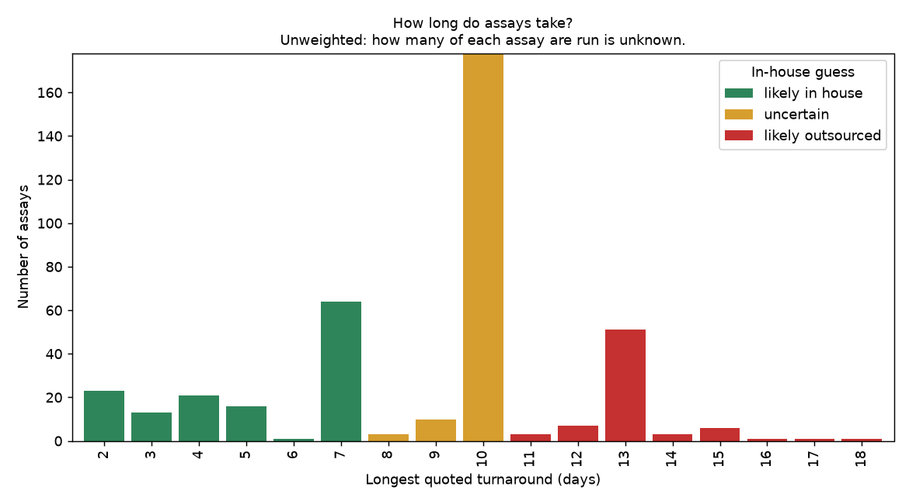

# Assay information

Reference data about the assays in the instrument fleet plan, plus tables derived from it.

| File | What it is |
|:--|:--|
| [lightlabs-assays.tsv](lightlabs-assays.tsv) | Original assay list (402 assays). Untouched source; never edit. |
| [assays-instrument-turnaround.csv](assays-instrument-turnaround.csv) | One row per assay with turnaround split into min and max days, an in-house guess, and a guessed instrument type. |
| [instrument-types.md](instrument-types.md) / [.csv](instrument-types.csv) | Definition table for every instrument type used (what ELISA, ICP-MS, HPLC, and the others are), with assay counts. |
| [plots/](plots) | Charts of turnaround time (see [Plots](#plots)). |
| [scripts/build_assay_tables.py](scripts/build_assay_tables.py) | Regenerates the two derived tables from the original. |
| [scripts/plot_assays.py](scripts/plot_assays.py) | Regenerates the plots from the derived table. |

## Turnaround days

`turnaround_min_days` and `turnaround_max_days` come from the original `TURNAROUND` text. A range such as
`7-10 days` gives 7 and 10. A single value such as `2 days` gives the same number in both columns.
"Business days" is treated as plain days. The original wording is kept in `turnaround_original`.

## In-house guess

`in_house_guess` is a guess from the longest quoted turnaround (`turnaround_max_days`). Short turnaround
suggests the work is done in the lab itself; long turnaround suggests shipping to and queuing at another lab.
`in_house_basis` records the number used. The cut-offs are constants at the top of
[build_assay_tables.py](scripts/build_assay_tables.py).

| Guess | Rule (longest turnaround) | Assays |
|:--|:--|--:|
| likely in house | 7 days or fewer | 138 |
| uncertain | 8 to 10 days | 191 |
| likely outsourced | 11 days or more | 73 |

Most assays quote 7-10 days, so the "uncertain" band is large. Turnaround alone cannot settle this; it should
be checked against who actually runs each assay.

## Plots

All plots are per assay or per group of assays. **How many of each assay is run is unknown**, so nothing is
weighted by volume. That is an open question: a slow assay that is rarely run matters less than a slightly
faster one that is run constantly.

| Plot | Shows |
|:--|:--|
| [01 distribution](plots/01-turnaround-distribution.png) | Number of assays at each longest turnaround, colored by in-house guess. |
| [02 slowest assays](plots/02-slowest-assays.png) | The 30 assays with the longest quoted turnaround. |
| [03 by category](plots/03-turnaround-by-category.png) | Median min to max turnaround for each category. |
| [04 by instrument type](plots/04-turnaround-by-instrument-type.png) | Median min to max turnaround for each instrument type. |
| [05 in-house guess by instrument type](plots/05-in-house-guess-by-instrument-type.png) | Assay counts per instrument type, split by in-house guess. |
| [06 in-house guess by category](plots/06-in-house-guess-by-category.png) | Assay counts per category, split by in-house guess. |



## Instrument type (a guess)

The instrument type is inferred, not vendor data. `instrument_basis` and `instrument_confidence` say how:

| Basis | Meaning | Confidence |
|:--|:--|:--|
| stated in text | An instrument is named in the assay's description or testing process. If other instruments are also named they are listed in `other_instruments_mentioned` and confidence is medium. | high / medium |
| inferred from assay name | The text names no instrument (for example Ash, pH, Brix); the type follows from the assay. | high / medium / low |
| inferred from text | Keywords such as "plated" or "titrate" in the text. | medium |

`instrument_type` is the primary instrument only. Rows marked medium or low are the ones to review first.

## Rebuild

```bash
conda activate instrument-fleet-plan
python assays/scripts/build_assay_tables.py
python assays/scripts/plot_assays.py
```

The script asserts that every instrument type has a definition. To change a guess, edit the rules or the
definitions in the script and rerun; do not hand-edit the generated files.

## Open questions

- How many of each assay are run is unknown, so volume is not part of these tables.
- Which assays are done in house is not yet decided (a later step, based on turnaround time).
