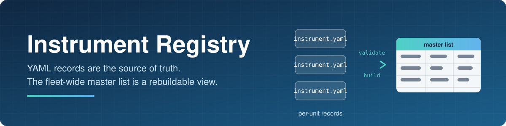
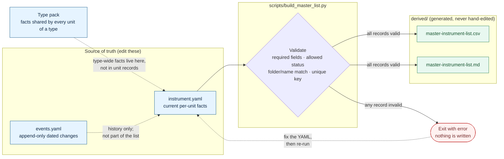

<p align="center">
  
</p>

<h1 align="center">Instrument Registry</h1>

<p align="center">
  A small, fictional example of a master instrument list for a mixed fleet.
</p>

<p align="center">
  
  
  
</p>

---

## Overview

This example follows the registry model in the
[instrument fleet plan](../../local/instrument-fleet-plan.md):

- **Per-instrument YAML files are the source of truth.**
- **The fleet-wide list is a rebuildable view** generated from those files.
- All instruments, locations, teams, and serials here are invented.

## Table of contents

- [How it works](#how-it-works)
- [Quick start](#quick-start)
- [Repository layout](#repository-layout)
- [Naming conventions](#naming-conventions)
- [What belongs in an instrument record](#what-belongs-in-an-instrument-record)
- [Adding or changing an instrument](#adding-or-changing-an-instrument)
- [Scope](#scope)

## How it works



1. Each unit has an `instrument.yaml` (current facts) and an append-only
   `events.yaml` (dated changes). Facts shared by every unit of a type, such as
   connection instructions, baseline versions, and retention, belong in that
   type's type pack.
2. `build_master_list.py` loads every `instruments/<type>/<serial>/instrument.yaml`
   and validates it.
3. If every record is valid, it writes both fleet-wide views to `derived/`.
   If any record is invalid, it exits with an error and writes neither.

## Quick start

Requires Python 3 and [PyYAML](https://pypi.org/project/PyYAML/).

```bash
pip install pyyaml
python scripts/build_master_list.py
```

Expected output:

```text
Validated 4 instruments; wrote CSV and Markdown views to <path>/derived
```

The generated files in `derived/` are convenient fleet-wide views, not editable
records. Change the YAML source files, then regenerate both views.

The script checks required fields, allowed statuses, directory/name consistency,
and case-insensitive uniqueness of the permanent key before writing either
output.

## Repository layout

```text
examples/Instrument-Registry/
├── README.md
├── assets/
│   └── banner.svg
├── instruments/
│   ├── FakeSeq-9000/
│   │   ├── 000417/
│   │   │   ├── instrument.yaml
│   │   │   └── events.yaml
│   │   └── FS9K-00533/
│   │       ├── instrument.yaml
│   │       └── events.yaml
│   ├── FakePlate-200/
│   │   └── 000417/
│   │       ├── instrument.yaml
│   │       └── events.yaml
│   └── FakeScope-100/
│       └── SCOPE-00502/
│           ├── instrument.yaml
│           └── events.yaml
├── scripts/
│   └── build_master_list.py
└── derived/
    ├── master-instrument-list.csv
    └── master-instrument-list.md
```

Current output of the generated list, [master-instrument-list.md](derived/master-instrument-list.md):

| Key | Nickname | Status | Owner team | Site | Room | Version |
|---|---|---|---|---|---|---|
| `FakePlate-200/000417` | bluejay | active | assay-automation | Building 2 | B216 | 2.8.0 |
| `FakeScope-100/SCOPE-00502` | old-faithful | retired | imaging-core | Building 1 | A012 | 1.9.4 |
| `FakeSeq-9000/000417` | daffy | active | genomics-core | Building 2 | B214 | 4.2.1 |
| `FakeSeq-9000/FS9K-00533` | darkwing | repair | genomics-core | Building 3 | C105 | 4.2.1 |

## Naming conventions

| Item | Convention | Example |
|---|---|---|
| Type slug | Stable, no spaces or path separators; use letters/digits and hyphens | `FakeSeq-9000` |
| Serial | Store as a string, preserving leading zeroes; this example uses letters/digits/hyphens | `000417` |
| Permanent key | `<type>/<serial>`; immutable and globally unique | `FakeSeq-9000/000417` |
| Unit folder | `instruments/<type>/<serial>/` | `instruments/FakeSeq-9000/000417/` |
| Record filename | Always `instrument.yaml`; event history is `events.yaml` | `instrument.yaml` |
| Nickname | Optional, human-friendly, editable alias; never an identifier | `daffy` |

> [!NOTE]
> A serial number is not globally unique by itself. This example deliberately
> reuses `000417` for `FakeSeq-9000` and `FakePlate-200`; their permanent keys and
> folders remain distinct because the type is part of the key.

Do not put a nickname, location, software version, assay category, or status in
the permanent key or unit path. Those values can change. Assay categories are
derived from assays actually run; they are not instrument identity.

## What belongs in an instrument record

| Category | Contents |
|---|---|
| **Identity** | `type`, `serial`, and the matching permanent `key` |
| **Current per-unit facts** | Optional nickname, status, owner team, location, declared software version, and commissioning date |
| **History** | Dated moves, repairs, calibrations, and other changes in `events.yaml`; keep history rather than silently rewriting past events |
| **Type-wide facts** | Store in the type pack, not duplicated across units |

Example `instrument.yaml`:

```yaml
schema_version: 1
key: FakeSeq-9000/000417
type: FakeSeq-9000
serial: "000417"
nickname: daffy
status: active
owner_team: genomics-core
location:
  site: Building 2
  room: B214
  bench: "3"
software:
  declared_version: "4.2.1"
  declared_on: 2026-06-14
hardware:
  commissioned_on: 2025-11-20
```

> [!CAUTION]
> Never store passwords, tokens, or private keys in the registry. If connection
> metadata is needed, store only an approved secret reference.

### Statuses

| Status | Meaning |
|---|---|
| `active` | In service |
| `repair` | Out of service for repair |
| `retired` | Kept for history and traceability; never reuse its key for another instrument |

## Adding or changing an instrument

1. Create `instruments/<type>/<serial>/instrument.yaml` and `events.yaml`.
2. Keep the serial as a YAML string (quote it if needed to preserve leading
   zeroes), and set `key` exactly to `<type>/<serial>`.
3. Record current per-unit facts only. Put shared type information in the type
   pack and record dated changes in `events.yaml`.
4. Run `python scripts/build_master_list.py`. Fix validation errors before
   using the generated inventory.
5. Review the source changes and generated list together. Do not hand-edit
   files under `derived/`.

## Scope

This example illustrates the data layout and naming policy; it does not define
a production schema, approval workflow, access policy, or connection standard.
