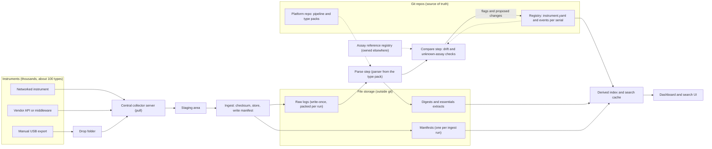
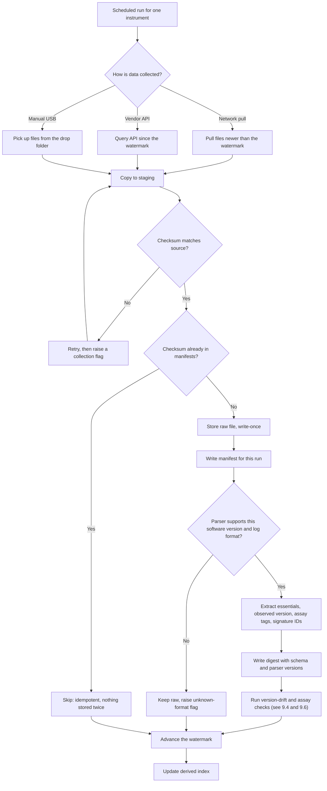
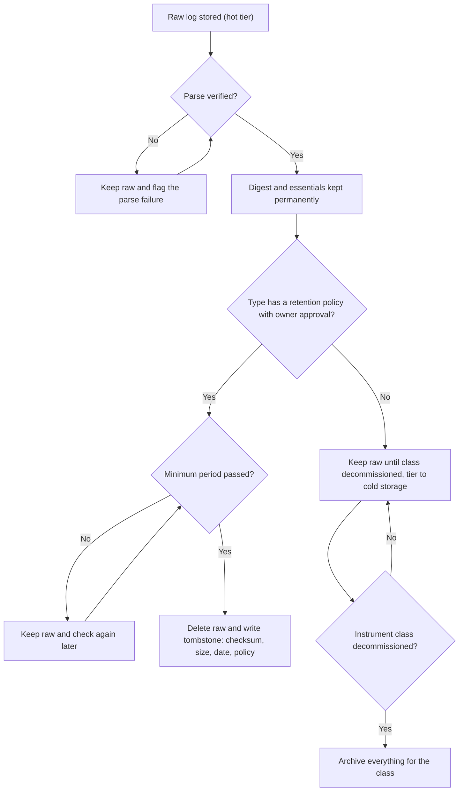
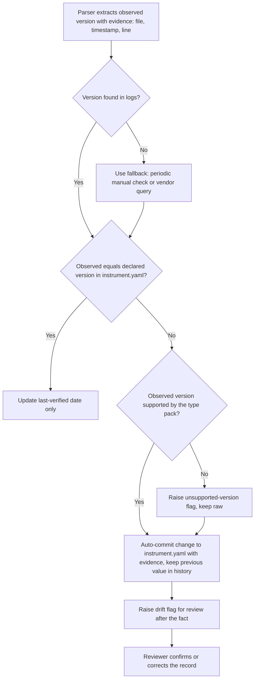
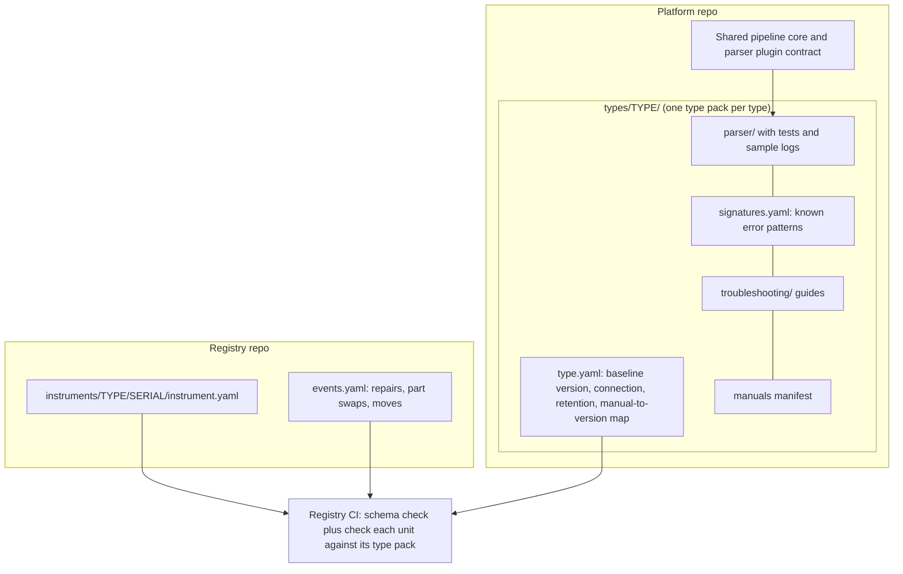
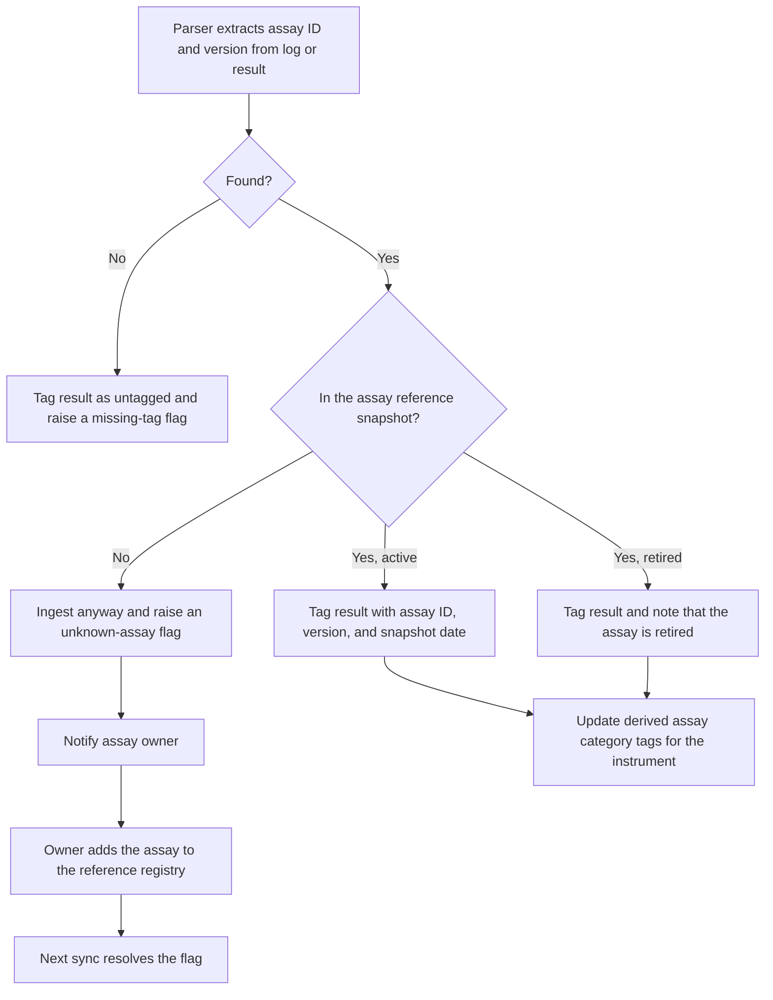
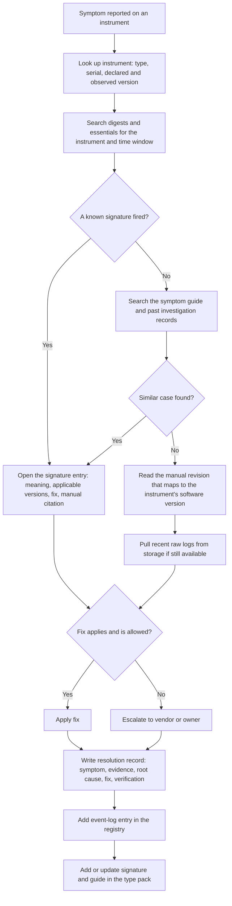
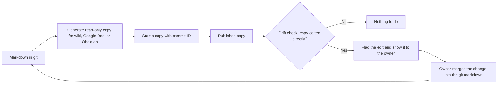
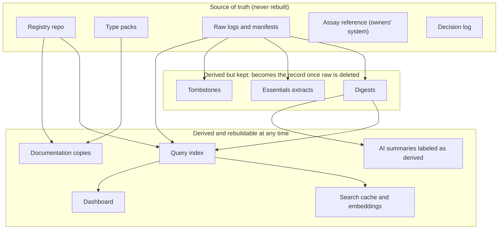
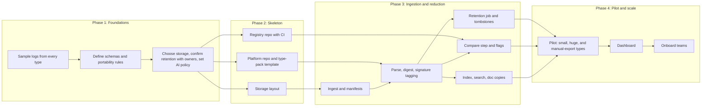

# Instrument fleet data platform: complete step-by-step explanation

Date: 2026-09-30. Status: planning only. Companion to `instrument-fleet-plan.md` (the concise plan and decision list). This file explains every step and why it exists. Flow charts are in section 9, and advantages and disadvantages are in section 10.

## 1. The problem in one paragraph

There are about 100 instrument types, with dozens of units of each (thousands of instruments). Each instrument runs one or more assays, and there are hundreds of assays owned by other people. You need, for every instrument: its identity and software versions, how to connect to it, its log files, and enough assay information to correlate logs and results with assays. Logs total 1-10 TB per month, and some individual logs (for example DNA sequencers) are enormous. The system must scale and eventually be used by several trained teams.

## 2. How the design evolved (and why)

| Stage | Idea | What changed it |
|---|---|---|
| Start | One git repo per instrument, holding logs and results | Git is poor at large, growing, append-only data; the wording also mixed up "per type" and "per unit" |
| Then | One repo per instrument type with a folder per serial number | 100 types means 100 repos that drift from their template and are hard to query together |
| Then | Pointer file in git listing every log | Thousands of commits per day; object storage cannot append to one file |
| Then | Registry repo + platform/parsers repo + external storage + manifests beside the data + derived index | Splits the design by what changes and why, not by instrument type |
| Now | Registry (per-serial facts) + platform repo with a type pack per type (type facts, parser, troubleshooting) | Parsers and troubleshooting change together and are needed together in one checkout (confirmed) |

## 3. The pieces and why each one exists

### 3.1 Registry repo (git): the source of truth for instruments
- **What:** one `instrument.yaml` and one events log per unit: per-serial facts only (serial, nickname, location, declared software version and change history, repairs, moves). Type-level facts (baseline software version, connection procedure, retention policy, manual-to-version map) live in the type packs in 3.2 and 3.15.
- **Why git:** the content is small text that benefits from history, review, and diffs. Software updates are infrequent, so a reviewed pull request per change is a good fit.
- **Why a single registry:** you can validate every file against a schema in CI (including checking each unit against its type pack), and answer fleet-wide questions such as "which units run version X" from one checkout. Thousands of small YAML files are well within what git handles.
- **Why not one repo per type:** 100 repos would each need template updates, and cross-type questions would need 100 clones.

### 3.2 Platform and type packs repo (git): code and type knowledge
- **What:** the shared pipeline, the parser plugin contract, and one type pack per type under `types/<type>/` (see 3.15), with tests and small anonymized sample logs. Code owners are set per folder.
- **Why separate from the registry:** type packs change when log formats or software change; instrument records change when hardware or software changes at one unit. They have different change rates, owners, and review needs.
- **Why not a repo per type by default:** it is extra overhead until a type has a different owner, access rule, or release cadence. Each type pack is a self-contained folder, so it can be split out later.

### 3.3 Bulk log storage: object storage outside git
- **What:** S3-compatible object storage with a path like `<type>/<serial>/<date>/`. Raw files are write-once. Lifecycle rules move older data to cheaper tiers.
- **Why:** git history grows forever and gets slow at GB-TB scale. Object storage is built for large volumes and lifecycle tiering. Nothing constrains the choice today, so this is the natural fit.

### 3.4 Manifests beside the data
- **What:** each ingest run writes one small write-once manifest listing the files it stored (instrument key, file names, checksums, sizes, dates).
- **Why not a pointer file in git:** it would create a commit for every log arrival, and thousands of instruments would drown the history.
- **Why not one growing file next to the data:** object storage cannot append, so every update would rewrite the whole file and concurrent runs could overwrite each other.
- **Why no new-file detector:** ingestion is the only writer, so it already knows what it added. A periodic reconcile job compares the storage listing to the manifests to catch anything that arrived another way.

### 3.5 Derived index
- **What:** a queryable index (SQLite or Parquet first, Postgres later) built from the manifests.
- **Why derived:** it can be deleted and rebuilt at any time, so it is never a second source of truth. Starting simple keeps the operations burden low for a small team.

### 3.6 Log reduction for huge files
- **What:** each parse produces (a) a small lossless essentials extract (version lines, errors, run IDs, timestamps), and (b) a structured digest with a common envelope plus a type-specific payload. The raw file is deleted after its retention period. Deletions leave a tombstone.
- **Why:** raw size drives cost, but the useful information is small. The essentials extract protects you if a parser bug is found after the raw file is gone. Tombstones let you prove what existed.
- **Why record the schema and parser versions in the digest:** so you know how to interpret it and which digests need regenerating if a parser is fixed.

### 3.7 Version tracking: declared versus observed
- **What:** `instrument.yaml` holds the declared software version and a change history. The log scan produces the observed version with evidence (file, timestamp, line). A mismatch raises a drift flag.
- **Why two values:** the difference is the useful signal. Updates are rare, so any drift is worth attention.
- **Why auto-record and review after:** it was your choice. The safeguard is that changes are never silent: evidence is attached and the previous value is kept.
- **Risk:** it is unknown whether every type logs its version. Phase 1 checks this, and types that don't need a fallback (periodic manual check or a vendor query).

### 3.8 Assay reference registry
- **What:** a separate registry synced from the assay owners, with versioned, immutable entries marked active or retired.
- **Why separate:** assays go stale and are owned by others, so copies would rot.
- **Why immutable versions and snapshot dates:** old results must stay interpretable after an assay changes.
- **Why ingest and flag unknown assays instead of blocking:** blocking would lose data, and the fix (adding the assay to the reference) can happen later.

### 3.9 Naming
- **What:** the key is type plus serial, and never changes. A nickname (for example a cartoon character) is an editable alias. The 7+ assay categories are tags derived from the assays an instrument has actually run.
- **Why:** serial numbers alone can collide across vendors. Nicknames run out at thousands of units and get reassigned. Instruments run several assays and the mix changes, so a category cannot be part of an ID or path. No spaces in file names.

### 3.10 Collection
- **What:** a central server pulls from instruments, copies all raw files to storage, then parses them. Ingestion is idempotent, keeps a per-instrument watermark, and retries. Manual USB exports go to a drop folder.
- **Why:** it matches how you said collection will have to work. The trade-off is that huge logs cross the network before they are reduced. This is mitigated with bandwidth limits and stream-parsing. A type can later switch to parsing near the instrument without changing the rest of the design.

### 3.11 Retention and deletion
- **What:** raw data is kept until the whole class is decommissioned, then archived. In the meantime it is tiered to cold storage. Huge raw logs are deleted under a per-type policy that data owners approve.
- **Why tier:** 1-10 TB per month becomes hundreds of TB over years.
- **Why deletion needs approval and a verified parse:** deletion is irreversible, and a parser bug can only be fixed while raw exists.

### 3.12 Parser and software-version coupling
- **What:** each parser declares the software version range it understands.
- **Why:** an unknown version or log format then raises a flag and the raw file is kept. It never fails silently.

### 3.13 Portability: no lock-in (added after review)
- **What:** all data and metadata are plain, open, self-describing files: Markdown, YAML, JSON/JSONL, CSV or Parquet, gzip or zstd, tar. No proprietary database, vendor storage feature, or AI service holds the truth. Indexes, search caches, dashboards, and AI output are all derived and can be rebuilt from the files.
- **Storage:** the storage location is a configurable root path and every reference is relative to it. Object storage is optional and can be swapped for a file share without changing the layout. Tiering, checksums, and retention are our own scripts. This revises 3.3, which suggested S3-compatible storage.
- **Why:** tools and AI are changing quickly. If the data is simple files and all the context is recorded, any layer can be replaced later without a migration.
- **Context to record with the data so anything can be changed later:** a `schema_version` in every file; parser, tool, and pipeline versions; collection time and source; checksums; retention policy and who approved it; and a short decision log saying what was decided and why.
- **LLMs and AI:** they read the files but never write the truth. Any AI-generated summary or answer is labeled as derived (model, date, inputs) and cannot overwrite the registry or manifests. Embeddings and vector indexes are rebuildable caches, not stored truth. Plain text with consistent names and front matter also makes the files easy for any future tool to read.
- **Trade-offs:**
  - Millions of small files strain shared file systems, so each run's logs are packed into one compressed archive with its manifest.
  - Without vendor tiering, moving old data to cold storage and checking integrity are scripts we must maintain.
  - "Keep everything" at 1-10 TB per month is expensive. It applies to small data, and, for huge raw files, to the context that lets a decision be revisited: the digest, the essentials extract, and the tombstone.

### 3.14 Troubleshooting knowledge per type, built like parsers (added after review)
- **What:** each type has a troubleshooting folder next to its parser containing:
  - a symptom-organized guide;
  - a known error signature catalog (pattern, meaning, software versions it applies to, fix, manual citation);
  - a manual index (source, revision, page);
  - links to past investigation records.
- **Why like parsers:** troubleshooting is instrument-specific, and it changes when the log format or software version changes, just as a parser does. The parser can tag each event with a signature ID, so digests record which signatures fired. "Which instruments hit signature X" then becomes a query, and a troubleshooter starts from evidence.
- **Manuals:** binaries stay in file storage with checksums and a manifest, and only extracted text is searched. The type definition maps each manual revision to the software versions it covers, because guidance for the wrong version misleads. Check redistribution rights before copying vendor manuals anywhere shared.
- **Resolution records:** each fix is written up with symptom, evidence (log references with checksums), root cause, fix, and verification. A matching entry goes in the instrument's event log in the registry (repair, part swap, move). Hardware events are tracked separately from software versions, because a repair is not an update.
- **Documentation copies:** wiki, Google Doc, or Obsidian copies are generated from the git markdown, read-only, and stamped with the commit they came from. Git stays the source of truth, and a drift check flags any direct edit to a copy. The Equipment-Management repo already follows this pattern, with a symptom-organized troubleshooting guide, investigation records, and a manuals corpus.
- **Search scope:** raw logs are outside git and can be huge or already deleted, so a single-repo search covers small derived files in git (digests, essentials, signatures, guides, manual text) plus a full-text index of them that can be rebuilt. A wrapper can reach into storage for recent raw files when needed. Grepping TB of raw logs is not workable.

### 3.15 Layout decision (confirmed): a per-type "type pack"
- **What:** a `types/<type>/` folder holds `type.yaml` (baseline version, connection procedure, retention policy, manual-to-version map), the parser, the troubleshooting content, the signature catalog, and manual manifests. The registry keeps only per-serial instance facts and event logs.
- **Why:** the parser and troubleshooting content change together (a new log format needs new signatures), and a troubleshooter needs them together in one checkout.
- **What it changes:** in the earlier design (3.1) the type definition lived in the registry. It now lives in the type pack, which is the one change to that design. The rule is: type-level facts (the same for every unit of a type) go in the type pack, and per-serial facts go in the registry. The folder layout stays the same if a type is later split into its own repo for access or ownership reasons.
- **Costs accepted:** the registry now depends on the type packs. Its schema CI checks each unit against its type pack (for example, that the declared software version is one the type supports), so the registry needs read access to the type packs. Also, a type pack change touches both parser code and type facts, so its reviewers need to understand both.

## 4. The steps in order, with reasons

### Phase 1: Foundations (blocks everything else)
1. **Sample logs from every type.** Record whether each contains a software version and assay ID/version, its format, and typical size. *Why:* the whole scanning and tagging idea depends on this, and it is currently unknown.
2. **Define the schemas.** Cover `instrument.yaml`, the instrument events log, `type.yaml`, the manifest, and the digest envelope. *Why:* every later component reads or writes these, so changing them late is expensive.
3. **Choose storage and hosting, and confirm retention with data owners.** *Why:* the storage layout and deletion rules depend on these, and owner approval is required before any deletion.

### Phase 2: Skeleton (depends on Phase 1; the two repos can be built in parallel)
4. **Create the registry repo** with schema validation in CI (including checks of each unit against its type pack) and an "add an instrument" template. *Why:* other people can then add instruments safely with a one-file pull request.
5. **Create the platform repo** with the plugin contract, a type-pack template, a parser test harness, and a scaffold command that creates a new `types/<type>/` folder. *Why:* teams can add a type without touching other parsers.
6. **Set up storage** with the path convention, lifecycle tiering, and write-once rules. *Why:* it must exist before ingestion can store anything.

### Phase 3: Ingestion and reduction (depends on Phase 2)
7. **Build pull, stage, checksum, store, and manifest.** Make it idempotent with a per-instrument watermark. *Why:* reruns and retries must not create duplicates or gaps.
8. **Build the parse step.** It produces the digest, the essentials extract, and the observed version and assay tags. *Why:* this is the step that makes huge logs manageable.
9. **Build the retention job.** It deletes raw files per policy and writes tombstones. *Why:* it controls storage cost, and records what was deleted.
10. **Build the compare step.** It flags version drift and unknown assays, and opens a reviewable change to `instrument.yaml`. *Why:* this delivers the version-confirmation and assay-flagging requirements.
11. **Build the index builder and the reconcile job.** *Why:* the index powers queries, and reconcile catches files that bypassed ingestion.

### Phase 4: Pilot, UI, and scale (depends on Phase 3)
12. **Pilot** on a small-log type, a huge-log type (sequencer), and a manual-export type. *Why:* these three cover the main differences in size and collection method.
13. **Add the dashboard.** It shows fleet versions, drift, unknown assays, and storage per type. *Why:* you asked for simple search and query, and it is how non-developers will use the system.
14. **Onboard teams** with a contributor guide covering adding an instrument, adding a type, and retention approval. *Why:* the goal is that trained teams can use it without you.

### Additions after review (where they fit)
15. **Phase 1:** write the portability rules (open formats only, relative paths, `schema_version` everywhere) and start the decision log. *Why:* the rules are cheapest to follow from the first file, and the log keeps the reasoning available to whoever changes the system next.
16. **Phase 1:** decide whether logs or manuals may be sent to external AI services. *Why:* the data is proprietary, and a tool that sends it out can break the policy.
17. **Phase 2:** define the type-pack layout, the signature catalog schema, the resolution record template, and the pack format for small-file runs. *Why:* parsers and troubleshooting content depend on these schemas.
18. **Phase 3:** have parsers tag signature IDs, build the rebuildable search index, and build the documentation-copy generator with its drift check. *Why:* they turn the catalog into something a troubleshooter can query, and keep copies from silently diverging from git.
19. **Phase 4:** in the pilot, replay one real past incident per pilot type through the troubleshooting content. *Why:* it shows whether the signatures, manual index, and version mapping lead to the documented fix.

## 5. Risks and holes to watch

1. **Deletion is irreversible.** Record owner approval with each retention policy. Delete raw only after a verified parse and a minimum period.
2. **Central copying of huge raw logs is network heavy.** Use bandwidth limits and stream-parsing, and allow a type to switch to parse-near-source later.
3. **Logs may not contain versions or assay IDs.** Found out in Phase 1; fallbacks exist for versions.
4. **Parsers break when software changes.** Version ranges and flag-and-keep-raw behavior contain the damage.
5. **The index and dashboard must not become a second source of truth.** They are derived and rebuildable, and the registry and manifests remain the truth.
6. **Access control.** Decide who can see which types' data before choosing hosting.
7. **Search cannot cover raw logs in git.** The raw logs are outside git and can be deleted. Search works over digests, essentials, and signatures, plus recent raw through a wrapper.
8. **Troubleshooting guidance goes stale or is version-mismatched.** Every signature and guide entry records the software versions it applies to and a date, and manuals are mapped to versions.
9. **Documentation copies drift from git.** Generate them read-only with a commit stamp, and check for direct edits.
10. **AI services and proprietary data.** Decide what may leave your environment before any AI tool reads logs or manuals. AI output stays labeled as derived.
11. **Manual redistribution.** Vendor manuals may not be copyable to shared locations. Check licenses and keep binaries in controlled storage.
12. **Small-file overload.** Millions of small log files strain file systems, so pack runs into archives.

## 6. Verification checklist

1. Ingest a file twice: one stored copy and one manifest entry.
2. Delete the index and rebuild it from manifests: the result matches.
3. Feed a parser an unknown log format: raw is kept and a flag is raised.
4. Run retention on a test type: raw is deleted only after a verified parse, and a tombstone is written.
5. Open a pull request that breaks the schema: CI rejects it.
6. Change a declared version on a test instrument: the scan flags drift and produces a commit with evidence.
7. Ingest a result whose assay is missing from the registry: it is ingested and flagged.
8. Change a nickname or category: no key or path changes.
9. Simulate 10 TB per month: ingest throughput and tiering hold.
10. Delete every index, dashboard, and search cache, then rebuild from the files alone: nothing is lost.
11. Every data file carries a `schema_version` and opens with standard tools, with no vendor software.
12. Replay one real past incident per pilot type: the signature catalog and manual index lead a person to the documented fix.
13. A generated documentation copy carries its commit stamp, and a direct edit to it is flagged by the drift check.

## 7. Scope

- **Included:** logs, registry, parsers, retention, drift and unknown-assay flagging, dashboard.
- **Excluded:** sequencer result data (handled elsewhere), assay content and analysis, and regulatory validation (the data is proprietary but not regulated).

## 8. Open items

- Storage and hosting choice (S3-compatible suggested; nothing constrains it yet).
- Whether each type's logs contain software version and assay ID/version.
- Per-type retention periods and owner approvals.
- Assay reference source, sync method, and tag format.
- Access control per type or team.
- Dashboard scope and tooling.
- Cross-repo access so the registry's CI can read the type packs.
- Whether logs or manuals may be sent to external AI services.
- Manual redistribution rights and where manual binaries live.
- Pack format for small-file runs (for example tar.zst) and the file-count limits of the chosen storage.
- Who writes and reviews signature catalogs and resolution records.

## 9. Flow charts

The charts use Mermaid, which Obsidian and VS Code preview render. "Type pack" means the `types/TYPE/` folder for one instrument type (see 3.15).

### 9.1 System overview: everything in one picture

### 9.2 Ingestion pipeline with decision points

### 9.3 Raw log lifecycle and retention

### 9.4 Software version tracking: declared versus observed

### 9.5 Repo layout and how they depend on each other

### 9.6 Assay tagging and unknown-assay flagging

### 9.7 Troubleshooting flow

### 9.8 Documentation copies (git is the source of truth)

### 9.9 Source of truth versus derived data

### 9.10 Build phases and dependencies

## 10. Advantages and disadvantages

### 10.1 Advantages

| Advantage | Why it holds |
|---|---|
| No lock-in | All data and metadata are plain open files, and every index, dashboard, and AI output is derived and rebuildable, so any tool can be replaced later. |
| Scales to thousands of instruments | Bulk data is in file storage, git holds only small text, and ingestion is idempotent with per-instrument watermarks. |
| Clear source of truth | Registry for per-serial facts, type packs for type facts, manifests and raw for data. Each fact has one home. |
| Full history and review | Git records who changed what and when. Version changes carry evidence from the logs. |
| Huge logs stay affordable | Reduction to digests and essentials, with owner-approved deletion and tombstones, controls storage cost without losing the record. |
| Parsers and troubleshooting stay in step | They live in one type pack, so a format change updates both together, and a troubleshooter needs one checkout. |
| Drift is visible | Comparing declared and observed versions turns silent changes into flags. |
| Assays stay out of your ownership | Only ID and version are tagged, unknown assays are flagged not blocked, and the reference is synced from the owners. |
| Safe for contributors | Schema CI, a type-pack template, and a scaffold command let trained teams add instruments and types without breaking others. |
| AI-friendly without depending on AI | Plain text with consistent names is easy for any future tool to read, and AI output is labeled as derived and never edits the truth. |
| Fits a small start | One person can build the pilot with a simple index, then grow into more tooling. |

### 10.2 Disadvantages and how to reduce them

| Disadvantage | Impact | Mitigation |
|---|---|---|
| Many moving parts | Collector, ingest, parsers, index, retention job, compare step, search, dashboard, doc-copy generator all need owners. | Build in phases, pilot with three types, and keep each piece small and replaceable. |
| Parser effort per type | About 100 parsers is the largest cost, and each breaks when software or log formats change. | Type-pack template, test fixtures, version ranges, and flag-and-keep-raw behavior. Prioritize the highest-volume or highest-risk types. |
| Version and assay data may not be in the logs | The scanning and tagging ideas depend on it. | Phase 1 discovery, plus fallbacks such as periodic manual or vendor checks. |
| Custom scripts replace vendor features | Tiering, integrity checks, and retention are ours to maintain. | Keep them simple, test them, and document them in the decision log. |
| Cross-repo dependency | Registry CI reads the type packs, so access and versions must line up. | Pin type-pack versions in CI and grant read access explicitly. |
| Mixed review skills | A type-pack change touches parser code and type facts. | Use CODEOWNERS and a review checklist, and split a type into its own repo if it needs separate owners. |
| Deletion is irreversible | A parser bug found after raw is deleted cannot be fixed by reparsing. | Owner approval, verified parse, minimum period, essentials extract, and tombstones. |
| Large raw copies cross the network | Central copying of huge logs is heavy. | Bandwidth limits and stream-parsing, and allow a type to switch to parse-near-source. |
| Small-file overload | Millions of files strain shared file systems. | Pack each run into one compressed archive plus its manifest. |
| Git and storage can disagree | Auto-commits from scans are derived from data outside git. | Reconcile job, evidence in every commit, and rebuild checks. |
| Auto-recorded version changes | A wrong scan could record a wrong version. | Evidence attached, prior value kept in history, and human review afterward. |
| No turnkey interface | The dashboard and search are built, not bought. | Start with reports and a simple search, then add the dashboard in Phase 4. |
| Central server is a security target | It holds credentials and proprietary logs. | Keep credentials out of git, limit access, and decide the AI-service policy early. |
| Long-term cost | Keeping raw until class decommissioning at 1-10 TB per month adds up to hundreds of TB. | Tier to cold storage and revisit retention per type with owners. |

### 10.3 How it compares with the alternatives

| Approach | Strength | Weakness |
|---|---|---|
| This design: registry, type packs, file storage, derived index | Portable, scalable, one home per fact, good troubleshooting workflow | More to build and maintain than a bought product. |
| One repo per instrument type holding everything, including logs | Simple mental model | 100 repos drift, and git bloats with logs, so it does not scale. |
| Everything in one git repo with LFS | One tool to learn | Storage and history grow without limit, and TB-scale data is a poor fit. |
| A commercial platform or database as the system of record | Fast to start, built-in UI | Lock-in, which is what you want to avoid, and the data model may not fit 100 instrument types. |
