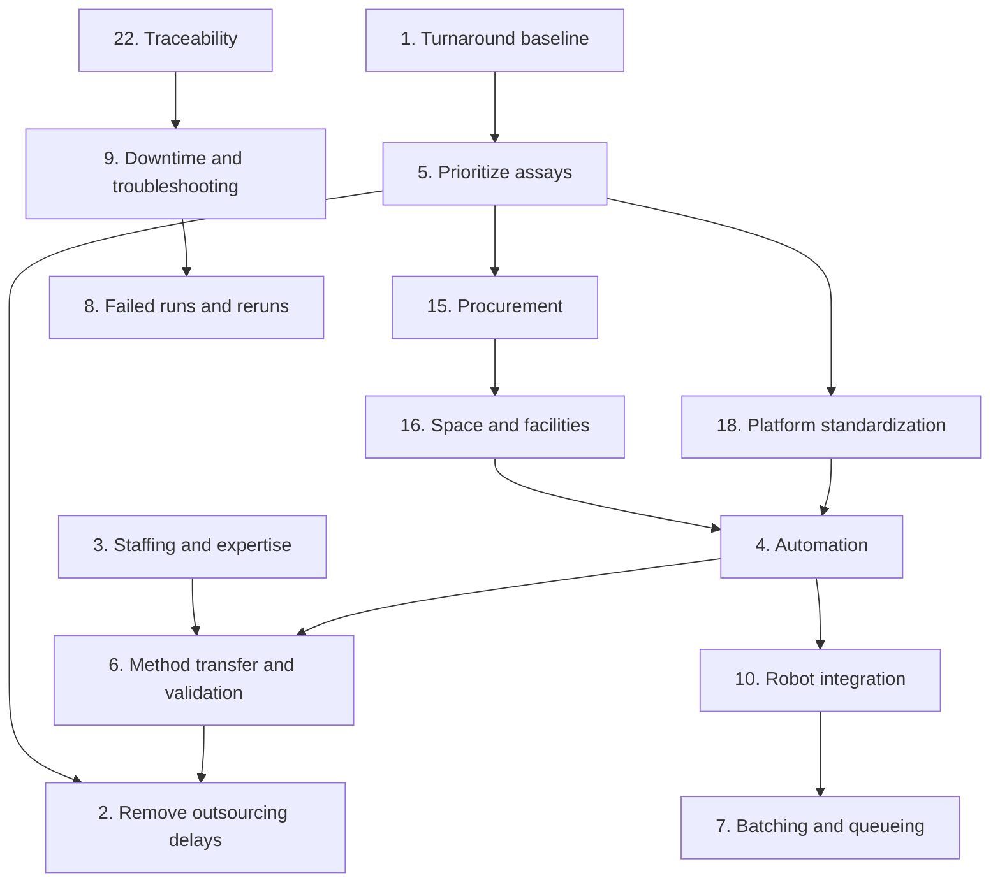

# Instrument fleet: potential problems, ranked

Date: 2026-10-01. Status: draft. Companion to [[instrument-fleet-problem-statement]], [[instrument-fleet-plan]], and [[instrument-fleet-plan-detailed-explanation]].

## How the ranking works

The goal is to **reduce assay turnaround time**: the time from requesting an assay to having a trusted, interpretable result. Problems are ranked from largest to smallest by:

1. **Size of the delay** the problem causes or prevents us from removing.
2. **Breadth**: how many of the about 400 assays, or how many instruments, it affects.
3. **Blocking**: whether other problems cannot be solved until this one is.

The ranking is a judgment call based on what is known today. Re-rank once a turnaround baseline exists (problem 1).

## Summary table

| Rank | Problem | Area |
|---|---|---|
| 1 | No measured baseline of turnaround time per assay | Measurement |
| 2 | Outsourcing delays: shipping, vendor queues, vendor turnaround | Outsourcing |
| 3 | Not enough people with assay-specific expertise | Staffing |
| 4 | Manual assay execution does not scale | Automation |
| 5 | No method for prioritizing which of the about 400 assays to bring in-house | Strategy |
| 6 | Method transfer and validation take a long time | In-house transition |
| 7 | Batching and queueing: waiting to fill plates or runs | Operations |
| 8 | Failed runs and reruns | Quality |
| 9 | Instrument downtime and slow troubleshooting | Instruments |
| 10 | Robot programming, scheduling, and integration are complex | Automation |
| 11 | Sample logistics, accessioning, and tracking gaps | Samples |
| 12 | Manual data handoff and result transcription | Data flow |
| 13 | Post-run analysis is manual | Data flow |
| 14 | Result review and sign-off bottleneck | Data flow |
| 15 | Capital procurement lead times and budget approval | Resources |
| 16 | Space, facilities, and lab layout (including pre- and post-PCR separation) | Resources |
| 17 | Reagent and consumable supply and lot qualification | Supply |
| 18 | Too many different assay platforms; little standardization | Strategy |
| 19 | Shared robotic platforms become single points of failure | Automation |
| 20 | Unclear assay ownership once in-house | Governance |
| 21 | Assay version changes not communicated or tracked | Governance |
| 22 | Results cannot be traced to instrument, software, and assay version | Traceability |
| 23 | Silent software updates change instrument behavior | Instruments |
| 24 | Vendor service response times and spare parts | Instruments |
| 25 | Calibration and preventive maintenance downtime | Instruments |
| 26 | PCR contamination events shut down work | Quality |
| 27 | Training time and keeping competency on low-volume assays | Staffing |
| 28 | Staff turnover and knowledge loss | Staffing |
| 29 | Low-volume assays may not justify in-house cost | Strategy |
| 30 | No status visibility for requesters | Communication |
| 31 | Sample ID and plate map errors | Data quality |
| 32 | Demand peaks exceed capacity | Operations |
| 33 | Instrument booking conflicts on shared equipment | Operations |
| 34 | Vendor contracts, kit licensing, and proprietary methods | Outsourcing |
| 35 | Possible compliance requirements once assays are in-house | Governance |
| 36 | Instruments that cannot be networked or run unsupported operating systems | IT |
| 37 | Closed vendor software and no APIs or middleware access | IT |
| 38 | Logs may lack software version and assay ID | Data platform |
| 39 | Parser effort for about 100 instrument types | Data platform |
| 40 | Log volume and network load (1-10 TB per month) | Data platform |
| 41 | Data platform has many moving parts and needs owners | Data platform |
| 42 | Team adoption and change management | People |
| 43 | Missing or outdated standard operating procedures | Quality |
| 44 | Sample stability and time-window constraints | Samples |
| 45 | Irreversible deletion of raw logs | Data platform |
| 46 | No dashboard or search interface yet | Data platform |
| 47 | Central collector server is a security target | IT |
| 48 | Policy on sending logs or manuals to external AI services | Governance |
| 49 | Vendor manual redistribution rights | Governance |
| 50 | Documentation copies drift from the source in git | Data platform |
| 51 | Naming collisions and nickname reuse | Data platform |

## Details

### Tier 1: largest impact on turnaround (ranks 1-9)

#### 1. No measured baseline of turnaround time per assay
- **Why it slows turnaround:** without knowing where time goes today (shipping, queue, run, analysis, review), effort may go to steps that are not the bottleneck. Success cannot be shown either.
- **What solving it involves:** record per assay the request date, sample receipt, run start, run end, result release, and whether it is outsourced. Break turnaround into stages. Use this to re-rank this list.

#### 2. Outsourcing delays: shipping, vendor queues, vendor turnaround
- **Why it slows turnaround:** every outsourced assay adds shipping, a vendor queue we do not control, and the time to receive results and resolve queries. This is likely the single largest controllable delay.
- **What solving it involves:** measure each vendor's turnaround, renegotiate service levels in the short term, and bring the highest-impact assays in-house (problems 5 and 6).

#### 3. Not enough people with assay-specific expertise
- **Why it slows turnaround:** an in-house assay is only fast if someone qualified is available to run it, troubleshoot it, and review results. With about 400 assays, expertise is spread thin and absences stop work.
- **What solving it involves:** plan staffing per assay family, not per assay. Cross-train at least two people per assay. Decide whether to hire, train existing staff, or both.

#### 4. Manual assay execution does not scale
- **Why it slows turnaround:** ELISAs, PCRs, and plate preparation by hand are slow, limited by staff hours, and error-prone. Manual pipetting errors cause reruns. The time saved by bringing an assay in-house can be lost to manual throughput.
- **What solving it involves:** identify the assays that need liquid handling and plate automation at the required volume. Choose robotic platforms that can cover several assays.

#### 5. No method for prioritizing which of the about 400 assays to bring in-house
- **Why it slows turnaround:** bringing assays in-house in the wrong order spends staff, money, and robot capacity on assays with small turnaround gains.
- **What solving it involves:** score each assay on:
  - turnaround gain;
  - volume;
  - cost;
  - feasibility;
  - whether it fits an existing or planned platform.

  Bring assays in-house in waves, starting with high-volume, high-gain assays that share a platform.

#### 6. Method transfer and validation take a long time
- **Why it slows turnaround:** an in-house assay cannot replace an outsourced one until it has been shown to give equivalent results. Validation needs samples, runs, and analysis, so the benefit is delayed.
- **What solving it involves:** a standard validation template per assay family, comparison runs against the outsourced results, and clear acceptance criteria agreed with assay owners up front.

#### 7. Batching and queueing: waiting to fill plates or runs
- **Why it slows turnaround:** many assays are run only when a plate or run is full, to save reagents and instrument time. Samples wait days for a batch even when the run itself is short.
- **What solving it involves:** measure queue time separately from run time. Set maximum wait times per assay. Use smaller formats or mixed-assay runs where the chemistry allows. Use automation to make small batches affordable.

#### 8. Failed runs and reruns
- **Why it slows turnaround:** every failed run, quality-control failure, or invalid result doubles turnaround for the affected samples and uses scarce sample material.
- **What solving it involves:** track the rerun rate and its causes per assay. Use automation to reduce pipetting errors. Link failures to instrument logs and known error signatures so causes are found quickly.

#### 9. Instrument downtime and slow troubleshooting
- **Why it slows turnaround:** when an instrument fails, assays stop. Without its history, software version, and past fixes, diagnosis takes longer. This grows as robots and new instruments join the fleet.
- **What solving it involves:** the instrument data platform:
  - registry;
  - log collection;
  - version tracking;
  - per-type troubleshooting guides and error signature catalogs.

  See [[instrument-fleet-plan-detailed-explanation]].

### Tier 2: large impact (ranks 10-19)

#### 10. Robot programming, scheduling, and integration are complex
- **Why it slows turnaround:** robots need methods written and validated per assay, scheduling software, and links to sample tracking and data systems. Poor integration makes robots sit idle or need manual steps between them.
- **What solving it involves:**
  - automation engineering expertise;
  - reusable method libraries;
  - a scheduler;
  - integration with sample tracking from the start.

#### 11. Sample logistics, accessioning, and tracking gaps
- **Why it slows turnaround:** samples that are hard to find, logged late, or waiting for retrieval from storage add time before any assay starts.
- **What solving it involves:** barcoded samples, a sample tracking system or laboratory information management system (LIMS), and recorded receipt and location times.

#### 12. Manual data handoff and result transcription
- **Why it slows turnaround:** copying results between instrument software, spreadsheets, and reporting systems is slow and causes errors that lead to rework.
- **What solving it involves:** automatic export from instruments into a standard format, and direct import into the results system with sample IDs checked.

#### 13. Post-run analysis is manual
- **Why it slows turnaround:** fitting ELISA standard curves, calling PCR Ct values, and checking controls by hand take time and vary between people.
- **What solving it involves:** scripted, versioned analysis pipelines per assay family, with automatic quality-control flags.

#### 14. Result review and sign-off bottleneck
- **Why it slows turnaround:** finished results wait for one qualified reviewer.
- **What solving it involves:**
  - more than one approved reviewer per assay;
  - auto-release of results that pass all quality-control rules;
  - a review queue that people can see.

#### 15. Capital procurement lead times and budget approval
- **Why it slows turnaround:** robots and new instruments need budget approval, purchasing, delivery, installation, and qualification before any assay can move in-house.
- **What solving it involves:** a capital plan tied to the assay priority list (problem 5), and starting procurement early for the first wave.

#### 16. Space, facilities, and lab layout
- **Why it slows turnaround:** robots and added instruments need:
  - bench or floor space;
  - power;
  - HVAC;
  - network.

  PCR needs separated pre- and post-amplification areas. Without space, in-house work cannot start or runs into contamination problems.
- **What solving it involves:** a space and facilities assessment per wave, and a lab layout designed for sample flow.

#### 17. Reagent and consumable supply and lot qualification
- **Why it slows turnaround:** stockouts stop assays, and new reagent lots may need qualification before use.
- **What solving it involves:**
  - inventory tracking;
  - reorder points;
  - standardized consumables across platforms;
  - lot qualification scheduled ahead of need.

#### 18. Too many different assay platforms; little standardization
- **Why it slows turnaround:** 400 assays across many formats multiplies:
  - training;
  - methods;
  - consumables;
  - instruments;
  - troubleshooting knowledge.
- **What solving it involves:** consolidate assays onto a small number of platforms and formats where scientifically acceptable.

#### 19. Shared robotic platforms become single points of failure
- **Why it slows turnaround:** consolidation (problem 18) means one robot outage can stop many assays at once.
- **What solving it involves:** redundancy for high-use platforms, service contracts, manual fallback procedures, and fast troubleshooting from the data platform.

### Tier 3: moderate impact (ranks 20-35)

#### 20. Unclear assay ownership once in-house
- **Why it slows turnaround:** assays are currently owned by others. Once in-house, questions about changes, failures, and acceptance criteria wait for an owner who may not be identified.
- **What solving it involves:** a named owner and a backup per assay, recorded in the assay reference registry.

#### 21. Assay version changes not communicated or tracked
- **Why it slows turnaround:** an assay that changes without notice can produce results that do not match earlier ones, causing investigation and reruns.
- **What solving it involves:** a versioned assay reference registry with immutable versions, synced from owners, plus flags for unknown assays.

#### 22. Results cannot be traced to instrument, software, and assay version
- **Why it slows turnaround:** when a result looks wrong, finding what produced it takes manual investigation.
- **What solving it involves:** tag every result with instrument key, software version, and assay version through the data platform.

#### 23. Silent software updates change instrument behavior
- **Why it slows turnaround:** an unnoticed update can change results or break methods and parsers, causing failures that take time to diagnose.
- **What solving it involves:** declared-versus-observed version tracking with drift flags, and change control for updates on validated instruments.

#### 24. Vendor service response times and spare parts
- **Why it slows turnaround:** some failures need a vendor engineer or parts, and downtime lasts as long as the vendor's response.
- **What solving it involves:**
  - service agreements with response-time terms;
  - spare parts for common failures;
  - in-house first-line repair skills.

#### 25. Calibration and preventive maintenance downtime
- **Why it slows turnaround:** planned maintenance takes instruments offline, and missed maintenance leads to failures.
- **What solving it involves:** maintenance schedules in the registry, planned around demand, and staggered across redundant units.

#### 26. PCR contamination events shut down work
- **Why it slows turnaround:** amplicon contamination can stop PCR work until areas are cleaned and controls are clean again.
- **What solving it involves:**
  - physical separation;
  - one-way workflow;
  - routine environmental testing;
  - closed-tube or automated systems where possible.

#### 27. Training time and keeping competency on low-volume assays
- **Why it slows turnaround:** training takes time, and staff lose proficiency on assays they rarely run, leading to slower runs and more errors.
- **What solving it involves:** training plans per assay family, periodic competency checks, and automation to reduce reliance on hands-on skill.

#### 28. Staff turnover and knowledge loss
- **Why it slows turnaround:** when an expert leaves, the assays and troubleshooting knowledge they held slow down or stop.
- **What solving it involves:** written procedures, troubleshooting records in the type packs, and cross-training.

#### 29. Low-volume assays may not justify in-house cost
- **Why it slows turnaround:** bringing rarely run assays in-house can tie up staff and equipment without a meaningful turnaround gain.
- **What solving it involves:** keep low-volume assays outsourced with negotiated turnaround, and revisit if volume grows.

#### 30. No status visibility for requesters
- **Why it slows turnaround:** requesters do not know where their samples are, which leads to follow-up messages and interruptions, and delays are found late.
- **What solving it involves:** a status view per request driven by sample tracking.

#### 31. Sample ID and plate map errors
- **Why it slows turnaround:** mismatched IDs or wrong plate layouts lead to investigations, invalid results, and reruns.
- **What solving it involves:** barcode scanning, plate maps generated by the system rather than typed, and automatic ID checks on import.

#### 32. Demand peaks exceed capacity
- **Why it slows turnaround:** study timelines can produce bursts of samples that overwhelm staff and instruments.
- **What solving it involves:** forecast demand with requesters, keep overflow outsourcing as a fallback, and plan capacity for peaks.

#### 33. Instrument booking conflicts on shared equipment
- **Why it slows turnaround:** assays wait for shared instruments held by other work.
- **What solving it involves:** a booking system with usage data, and adding capacity where conflicts are frequent.

#### 34. Vendor contracts, kit licensing, and proprietary methods
- **Why it slows turnaround:** some outsourced assays may use proprietary methods or kits that cannot be run in-house, or contracts may limit changes.
- **What solving it involves:** review contracts and licensing for priority assays before planning their transfer.

#### 35. Possible compliance requirements once assays are in-house
- **Why it slows turnaround:** the data is proprietary but not regulated today. If any assay supports clinical or regulated decisions, in-house work may need certification or quality-system controls, which add time before go-live.
- **What solving it involves:** confirm the regulatory status of each priority assay early.

### Tier 4: smaller or indirect impact (ranks 36-51)

These mostly affect the instrument data platform. They matter because the platform supports problems 8, 9, and 22, but each one alone has a smaller direct effect on turnaround.

#### 36. Instruments that cannot be networked or run unsupported operating systems
- **Impact:** logs must be collected by hand, which delays troubleshooting data.
- **Solving:**
  - manual export drop folders;
  - isolated network segments;
  - vendor-supported gateways.

#### 37. Closed vendor software and no APIs or middleware access
- **Impact:** automation and data export need workarounds.
- **Solving:** ask for API access as a purchasing requirement for new instruments.

#### 38. Logs may lack software version and assay ID
- **Impact:** version drift and assay tagging cannot be automated for those types.
- **Solving:** Phase 1 log sampling per type, with manual or vendor-query fallbacks.

#### 39. Parser effort for about 100 instrument types
- **Impact:** the largest cost of the data platform. Types without parsers get no automatic troubleshooting support.
- **Solving:** type-pack template, test fixtures, and prioritizing types that support high-priority assays.

#### 40. Log volume and network load (1-10 TB per month)
- **Impact:** storage cost and network congestion. Very large logs can slow collection.
- **Solving:** bandwidth limits, stream-parsing, log reduction to digests, and cold-storage tiering.

#### 41. Data platform has many moving parts and needs owners
- **Impact:** components without owners break and go unfixed.
- **Solving:** phase the build, pilot with three types, and assign an owner per component.

#### 42. Team adoption and change management
- **Impact:** new systems that are not used do not reduce turnaround.
- **Solving:** involve users early, train them, keep the "add an instrument" step to one file, and show turnaround gains.

#### 43. Missing or outdated standard operating procedures
- **Impact:** inconsistent runs and slower onboarding.
- **Solving:** write procedures as part of each assay transfer and keep them versioned.

#### 44. Sample stability and time-window constraints
- **Impact:** some samples must be run within a window. Delays cause sample loss, not just slower results.
- **Solving:** record stability limits per assay and prioritize those samples in the queue.

#### 45. Irreversible deletion of raw logs
- **Impact:** a parser bug found after raw logs are deleted cannot be fixed by reparsing.
- **Solving:**
  - owner approval;
  - verified parse;
  - a minimum retention period;
  - essentials extracts;
  - tombstones.

#### 46. No dashboard or search interface yet
- **Impact:** information exists but is slow to find.
- **Solving:** start with simple reports and search, then build the dashboard in Phase 4.

#### 47. Central collector server is a security target
- **Impact:** a breach could stop collection or expose proprietary data.
- **Solving:** keep credentials out of git, limit access, and review security.

#### 48. Policy on sending logs or manuals to external AI services
- **Impact:** without a policy, AI tooling is either blocked or risks leaking data.
- **Solving:** decide the policy in Phase 1.

#### 49. Vendor manual redistribution rights
- **Impact:** manuals may not be shareable, which limits troubleshooting content.
- **Solving:** check licenses and keep binaries in controlled storage.

#### 50. Documentation copies drift from the source in git
- **Impact:** people follow outdated guidance.
- **Solving:** generate read-only copies with a commit stamp, and run a drift check.

#### 51. Naming collisions and nickname reuse
- **Impact:** minor confusion over which instrument is meant.
- **Solving:** use type plus serial as the permanent key, and treat nicknames as editable aliases.

## Dependencies among the top problems

## Next steps

1. Measure turnaround per assay (problem 1) and re-rank this list.
2. Build the assay priority score (problem 5) using the turnaround data.
3. For the first wave of assays, plan staffing, robotics, validation, space, and procurement together, because they depend on each other.
