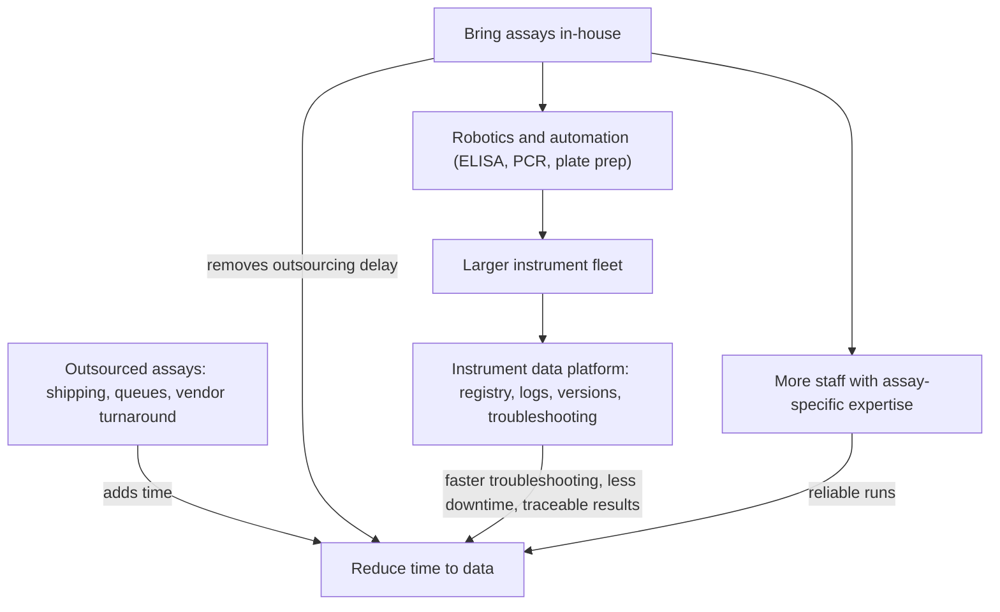

# Instrument fleet: problem statement

Date: 2026-10-01. Status: draft. Companion to [[instrument-fleet-plan]] (concise plan and decisions) and [[instrument-fleet-plan-detailed-explanation]] (step-by-step reasoning, flow charts, trade-offs).

## 1. Ultimate goal

**Reduce the time it takes to get data**: the time from deciding an assay should run to having a trusted, interpretable result.

Everything else (the instrument registry, log collection, version tracking, troubleshooting knowledge, bringing assays in-house, and automation) is a way to reach that goal. If a piece of work does not shorten time to data, or protect its quality, it should be questioned.

## 2. The current situation

### 2.1 Instruments
- About 100 instrument types, with dozens of units of each, for thousands of instruments in total.
- For each instrument we need its identity, software versions, how to connect to it, its log files, and enough assay information to link logs and results to assays.
- Logs total 1-10 TB per month. Some individual logs, such as those from DNA sequencers, are very large.
- Identity, software versions, and logs are not tracked consistently, so it is hard to answer:
  - Which units run a given software version?
  - What changed on an instrument before a failure?
  - Has this error been seen before, and how was it fixed?

### 2.2 Assays
- There are about 400 different assays, owned by other people.
- Many of these assays are currently outsourced.
- Assay definitions change and get retired, so a result can only be interpreted if we know which version of the assay produced it.

## 3. Why this is a problem

### 3.1 Outsourcing adds time
Outsourced assays add steps we do not control:
- shipping samples;
- waiting in the vendor's queue;
- vendor turnaround time;
- receiving results and getting them into our systems;
- resolving queries with the vendor.

Each step adds time to data, and the result often arrives without the instrument and run context needed to troubleshoot or compare it.

### 3.2 Bringing assays in-house is likely needed
To cut time to data substantially, many outsourced assays probably need to be brought in-house. This is a working assumption to confirm per assay (see section 6). Bringing assays in-house brings three new needs.

1. **More people with assay-specific expertise.** Each in-house assay needs people trained to run it, validate it, and troubleshoot it. With about 400 assays, expertise has to be planned per assay family, not per person.
2. **Robotics and automation.** Many assays, such as ELISAs and PCRs, need liquid handling and plate preparation. At volume these are hard to run reliably by hand. Without robotics, in-house runs would be:
   - slow;
   - error-prone;
   - limited by staff hours.

   The time saved by not outsourcing would then be lost.
3. **More instruments to track.** Robots, liquid handlers, plate readers, and thermocyclers join the fleet. That increases the load on the instrument registry, log collection, and troubleshooting system in [[instrument-fleet-plan-detailed-explanation]].

### 3.3 Poor instrument data slows everything
Even for assays already in-house, time is lost when:
- an instrument fails and nobody can quickly see its history, version, or past fixes;
- a software update silently changes behavior;
- logs are scattered, too large to search, or deleted before anyone checks them;
- results cannot be tied back to the instrument, software version, and assay version that produced them.

## 4. How the pieces connect to the goal

## 5. What success looks like

- Lower time to data for each assay brought in-house than when it was outsourced, measured before and after.
- Instrument downtime and time-to-fix go down because history, versions, and known error signatures are one search away.
- Every result can be traced to the instrument, software version, and assay version that produced it.
- Automated assays run with less hands-on time per sample than manual runs.
- Trained teams can add instruments, instrument types, and assays without depending on one person.

## 6. Open questions

- Which of the about 400 assays are outsourced today, and what is their current turnaround time and cost?
- Which assays should be brought in-house first? Rank by:
  - time-to-data gain;
  - volume;
  - cost;
  - feasibility.
- Which assays need robotics to run at the required volume, and which can stay manual?
- Can assays share robotic platforms? For example, one liquid handler might cover several ELISA and PCR assays, which reduces equipment and training needs.
- How many people, with which expertise, does each assay family need? Will we hire, train existing staff, or both?
- What validation is needed before an in-house assay replaces an outsourced one?
- Who owns each assay once it is in-house? Today assays are owned by others.
- What space, budget, and facilities do the robots and added instruments need?
- Do the robots and liquid handlers produce logs and version information the platform can use? This should be added to Phase 1 log sampling in [[instrument-fleet-plan-detailed-explanation]].

## 7. Scope of this note

This note describes the problem only. The data platform design is in [[instrument-fleet-plan]] and [[instrument-fleet-plan-detailed-explanation]]. Choosing which assays to bring in-house, hiring, and buying robots are separate decisions this problem statement is meant to inform.
